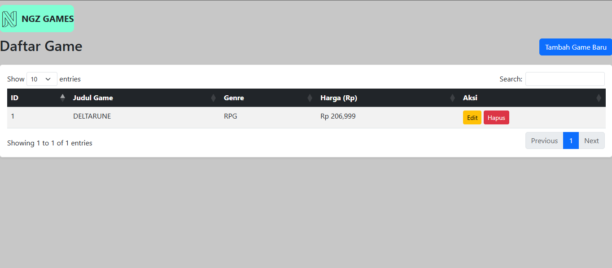
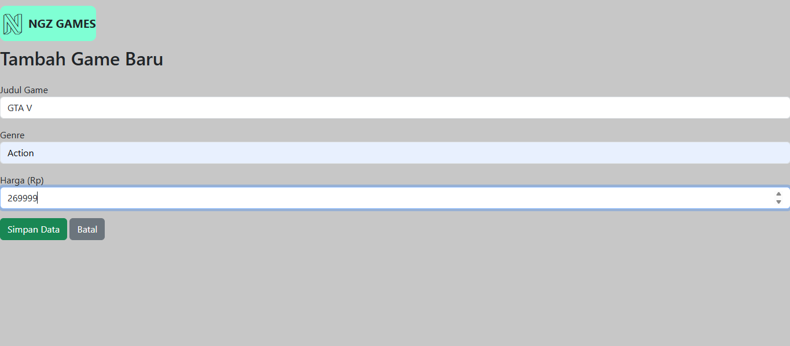

# Coding-On-The-Spot
Naufal Geraldo Putra Pramudianartono
2311102154
IF-11-04
Repository untuk Modul 7 & 8 Praktikum ABP

<h1 align="center">LAPORAN PRAKTIKUM APLIKASI BERBASIS PLATFORM</h1>

<br>

<h2 align="center">TUGAS COTS </h2>
<h2 align="center">ngz-games</h2>

<br><br>

<p align="center">

</p>
<br><br><br>

<h2 align="center">Disusun Oleh :</h2>

<p align="center" style="font-size:28px;">
  <b>Naufal Geraldo Putra Pramudianartono</b><br>
  <b>2311102154</b><br>
  <b>S1 IF-11-REG 04</b>
</p>
<br>
<h2 align="center">Dosen Pengampu :</h2>

<p align="center" style="font-size:28px;">
  <b>Cahyo Prihantoro, S.Kom., M.Eng </b>
</p>
<br>

<br>
<h1 align="center">LABORATORIUM HIGH PERFORMANCE</h1>
<h1 align="center">FAKULTAS INFORMATIKA</h1>
<h1 align="center">UNIVERSITAS TELKOM PURWOKERTO</h1>
<h1 align="center">TAHUN 2026</h1>

<hr>

## Dasar Teori
<p>CRUD adalah singkatan dari Create (membuat), Read (membaca), Update (memperbarui), dan Delete (menghapus), yang merupakan empat operasi dasar dalam pengelolaan data pada basis data (database)<p>
<p>Node.js adalah runtime environment untuk JavaScript yang bersifat open-source dan cross-platform. Dengan Node.js kita dapat menjalankan kode JavaScript di mana pun, tidak hanya terbatas pada lingkungan browser. Node.js menjalankan V8 JavaScript engine (yang juga merupakan inti dari Google Chrome) di luar browser. Ini memungkinkan Node.js memiliki performa yang tinggi.<p>
<p>jQuery adalah library JavaScript yang dirancang untuk menyederhanakan pemrograman HTML. Dengan jQuery, kamu bisa menangani event, membuat animasi, dan melakukan manipulasi dokumen dengan mudah. Plugin jQuery memiliki banyak plugin yang bisa kamu gunakan untuk menambah fungsionalitas pada aplikasi web<p>
  
## Struktur Halaman
### index.html

### tambah.html

### edit.html


## Koding Program
### index.js
```js
const express = require('express');
const mysql = require('mysql2');
const cors = require('cors');

const app = express();
const port = 3000;

app.use(cors());
app.use(express.json()); 
app.use(express.urlencoded({ extended: true }));
app.use(express.static('frontend')); 

const db = mysql.createConnection({
  host: 'localhost',
  user: 'root',
  password: '30mei2005',
  database: 'gamesdb'
});

db.connect((err) => {
  if (err) throw err;
  console.log('Terkoneksi ke database MySQL!');
});

// 1. READ: Mengambil semua data game (Untuk DataTables)
app.get('/api/games', (req, res) => {
    const sql = "SELECT * FROM games";
    db.query(sql, (err, results) => {
        if (err) return res.status(500).json({ error: err.message });
        res.json({ data: results }); 
    });
});

// 2. CREATE: Menambah game baru
app.post('/api/games', (req, res) => {
    const { title, genre, price } = req.body;
    const sql = "INSERT INTO games (title, genre, price) VALUES (?, ?, ?)";
    
    db.query(sql, [title, genre, price], (err, result) => {
        if (err) return res.status(500).json({ error: err.message });
        res.json({ message: "Game berhasil ditambahkan!" });
    });
});

// 3. READ 1 DATA: Mengambil data game spesifik (Untuk mengisi form edit)
app.get('/api/games/:id', (req, res) => {
    const id = req.params.id;
    const sql = "SELECT * FROM games WHERE id = ?";
    
    db.query(sql, [id], (err, results) => {
        if (err) return res.status(500).json({ error: err.message });
        if (results.length === 0) return res.status(404).json({ message: "Game tidak ditemukan" });
        res.json(results[0]); 
    });
});

// 4. UPDATE: Menyimpan hasil edit game
app.put('/api/games/:id', (req, res) => {
    const id = req.params.id;
    const { title, genre, price } = req.body;
    const sql = "UPDATE games SET title = ?, genre = ?, price = ? WHERE id = ?";
    
    db.query(sql, [title, genre, price, id], (err, result) => {
        if (err) return res.status(500).json({ error: err.message });
        res.json({ message: "Game berhasil diupdate!" });
    });
});

// 5. DELETE: Menghapus game
app.delete('/api/games/:id', (req, res) => {
    const id = req.params.id;
    const sql = "DELETE FROM games WHERE id = ?";
    
    db.query(sql, [id], (err, result) => {
        if (err) return res.status(500).json({ error: err.message });
        res.json({ message: "Game berhasil dihapus!" });
    });
});

app.listen(port, () => {
  console.log(`Server berjalan di http://localhost:${port}`);
});
```
Berikut adalah code main dari proyek yang menggunakan express.js sebagai tempat pengontrol CRUD atau Create (membuat), Read (membaca), Update (memperbarui), dan Delete serta berkomunikasi dengan mysql untuk mengakses database
### index.html
```html
<!DOCTYPE html>
<html lang="en">
<head>
    <meta charset="UTF-8">
    <meta name="viewport" content="width=device-width, initial-scale=1.0">
    <title>Document</title>
    <link rel="stylesheet" href="https://cdn.datatables.net/1.13.6/css/dataTables.bootstrap5.min.css">
    <link rel="stylesheet" href="https://cdn.jsdelivr.net/npm/bootstrap@5.3.0/dist/css/bootstrap.min.css">
    <link rel="stylesheet" href="css/style.css">
    <script src="https://kit.fontawesome.com/791ffebf52.js" crossorigin="anonymous"></script>
</head>
<body>
    <div class="icon">
        <i class="fa-brands fa-neos"></i>
        <p>NGZ GAMES</p>
    </div>
    
    <div class="d-flex justify-content-between align-items-center mb-3">
        <h2>Daftar Game</h2>
        <a href="tambah.html" class="btn btn-primary">Tambah Game Baru</a>
    </div>

    <div class="card p-3 shadow-sm">
        <table id="tabelData" class="table table-striped table-hover">
            <thead class="table-dark">
                <tr>
                    <th>ID</th>
                    <th>Judul Game</th>
                    <th>Genre</th>
                    <th>Harga (Rp)</th>
                    <th>Aksi</th>
                </tr>
            </thead>
            <tbody></tbody>
        </table>
    </div>

    <script src="https://code.jquery.com/jquery-3.7.0.min.js"></script>
    <script src="https://cdn.datatables.net/1.13.6/js/jquery.dataTables.min.js"></script>
    <script src="https://cdn.datatables.net/1.13.6/js/dataTables.bootstrap5.min.js"></script>

    <script>
        $(document).ready(function() {
            $('#tabelData').DataTable({
                "ajax": "/api/games",
                "columns": [
                    { "data": "id" },
                    { "data": "title" },
                    { "data": "genre" },
                    { "data": "price", render: $.fn.dataTable.render.number(',', '.', 0, 'Rp ') }, // Format rupiah
                    { 
                      "data": null,
                      "render": function(data, type, row) {
                          return `<a href="edit.html?id=${row.id}" class="btn btn-sm btn-warning">Edit</a>
                                  <button onclick="hapusData(${row.id})" class="btn btn-sm btn-danger">Hapus</button>`;
                      }
                    }
                ]
            });
        });

        function hapusData(id) {
            if(confirm("Yakin ingin menghapus game ini?")) {
                $.ajax({
                    url: `/api/games/${id}`,
                    type: 'DELETE',
                    success: function(response) {
                        // Me-refresh tabel otomatis
                        $('#tabelData').DataTable().ajax.reload();
                    },
                    error: function(err) {
                        alert("Gagal menghapus data!");
                    }
                });
            }
        }
    </script>
</body>
</html>
```
Halaman  ini menampilkan data game dalam bentuk tabel memakai jQuery DataTables. Data diambil dari database mysql. Pada halaman tersedia tombol aksi untuk melakukan tambah, update dan hapus data.
### tambah.html
```html
<!DOCTYPE html>
<html lang="en">
<head>
    <meta charset="UTF-8">
    <meta name="viewport" content="width=device-width, initial-scale=1.0">
    <title>Document</title>
    <link rel="stylesheet" href="https://cdn.datatables.net/1.13.6/css/dataTables.bootstrap5.min.css">
    <link rel="stylesheet" href="https://cdn.jsdelivr.net/npm/bootstrap@5.3.0/dist/css/bootstrap.min.css">
    <link rel="stylesheet" href="css/style.css">
    <script src="https://kit.fontawesome.com/791ffebf52.js" crossorigin="anonymous"></script>
</head>
<body>
    <div class="icon">
        <i class="fa-brands fa-neos"></i>
        <p>NGZ GAMES</p>
    </div>
    
    <h2>Tambah Game Baru</h2>
    <form id="formTambah" class="mt-4">
        <div class="mb-3">
            <label>Judul Game</label>
            <input type="text" id="title" class="form-control" required>
        </div>
        <div class="mb-3">
            <label>Genre</label>
            <input type="text" id="genre" class="form-control" required>
        </div>
        <div class="mb-3">
            <label>Harga (Rp)</label>
            <input type="number" id="price" class="form-control" required>
        </div>
        <button type="submit" class="btn btn-success">Simpan Data</button>
        <a href="index.html" class="btn btn-secondary">Batal</a>
    </form>
    
    <script src="https://code.jquery.com/jquery-3.7.0.min.js"></script>
    <script>
        $('#formTambah').submit(function (e) {
            e.preventDefault(); 

            const dataGame = {
                title: $('#title').val(),
                genre: $('#genre').val(),
                price: $('#price').val()
            };

            $.ajax({
                url: '/api/games',
                type: 'POST',
                data: dataGame,
                success: function (response) {
                    alert('Data berhasil ditambahkan!');
                    window.location.href = 'index.html';
                },
                error: function (err) {
                    alert('Gagal menambahkan data!');
                }
            });
        });
    </script>
</body>
</html>
```
Halaman  ini menampilkan form  menambah game baru. Ini adalah bagian C atau create dari CRUD dimana user dapat membuat data game berisi judul, genre, serta harga
### edit.html
```html
<!DOCTYPE html>
<html lang="en">
<head>
    <meta charset="UTF-8">
    <meta name="viewport" content="width=device-width, initial-scale=1.0">
    <title>Document</title>
    <link rel="stylesheet" href="https://cdn.datatables.net/1.13.6/css/dataTables.bootstrap5.min.css">
    <link rel="stylesheet" href="https://cdn.jsdelivr.net/npm/bootstrap@5.3.0/dist/css/bootstrap.min.css">
    <link rel="stylesheet" href="css/style.css">
    <script src="https://kit.fontawesome.com/791ffebf52.js" crossorigin="anonymous"></script>
</head>
<body>
    <div class="icon">
        <i class="fa-brands fa-neos"></i>
        <p>NGZ GAMES</p>
    </div>
    
    <h2>Edit Data Game</h2>
    <form id="formEdit" class="mt-4">
        <input type="hidden" id="id">
    
        <div class="mb-3">
            <label>Judul Game</label>
            <input type="text" id="title" class="form-control" required>
        </div>
        <div class="mb-3">
            <label>Genre</label>
            <input type="text" id="genre" class="form-control" required>
        </div>
        <div class="mb-3">
            <label>Harga (Rp)</label>
            <input type="number" id="price" class="form-control" required>
        </div>
        <button type="submit" class="btn btn-primary">Update Data</button>
        <a href="index.html" class="btn btn-secondary">Batal</a>
    </form>
    
    <script src="https://code.jquery.com/jquery-3.7.0.min.js"></script>
    <script>
        $(document).ready(function () {
            const urlParams = new URLSearchParams(window.location.search);
            const idGame = urlParams.get('id');

            $.get(`/api/games/${idGame}`, function (data) {
                $('#id').val(data.id);
                $('#title').val(data.title);
                $('#genre').val(data.genre);
                $('#price').val(data.price);
            });

            $('#formEdit').submit(function (e) {
                e.preventDefault();

                const dataUpdate = {
                    title: $('#title').val(),
                    genre: $('#genre').val(),
                    price: $('#price').val()
                };

                $.ajax({
                    url: `/api/games/${$('#id').val()}`,
                    type: 'PUT',
                    data: dataUpdate,
                    success: function (response) {
                        alert('Data berhasil diupdate!');
                        window.location.href = 'index.html';
                    }
                });
            });
        });
    </script>
</body>
</html>
```
Halaman ini menampilkan form mengedit informasi game yang sudah disimpan di database. Ini adalah bagian U atau update dari CRUD dimana user dapat memperbarui data udul, genre, serta harga pada sebuah game

## Link Video dan Presentasi
https://drive.google.com/drive/folders/1P9ac64gsQTRb3ICzQ8uczbSrpkIr_4sp?usp=sharing
